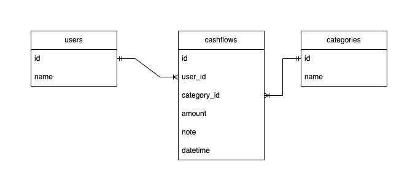
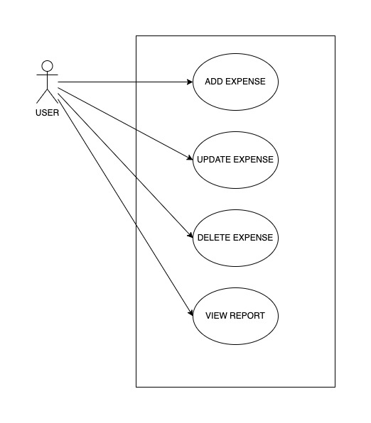

# Problem 1 - Diagram
## Entity Relationship Diagram

Terdapat 3 buah entity yakni:
1. Users
Entity users memiliki attribut sebagai berikut.

| Attribut | Keterangan |
| ----------- | ----------- |
| id [PK] | id user |
| name | nama user |

Entity ini memiliki relationship one-to-many terhadap entity cashflows, yang mana berarti 1 user dapat memiliki banyak cashflow. Adapun foreign key pada entity cashflows terhadap entity users adalah `user_id`.

2. Cashflows
Entity cashflows memiliki attribut sebagai berikut

| Attribut | Keterangan |
| ----------- | ----------- |
| id [PK] | id cashflow |
| user_id [FK] | id user |
| category_id [FK] | id kategori |
| amount | nominal pengeluaran |
| note | catatan tambahan pengeluaran |
| datetime | jam dan tanggal pengeluaran |

3. Categories

Entity categories memiliki attribut sebagai berikut.

| Attribut | Keterangan |
| ----------- | ----------- |
| id [PK] | id kategori |
| name | nama kategori |

Sama dengan entity users, entity ini memiliki hubungan one-to-many dengan entity cashflows. Dengan adanya relasi ini maka pengeluaran dapat dikelompokkan berdasarkan kategori.

## Use Case Diagram

Pada use case tersebut, terdapat 1 aktor yakni **USER** dimana ia dapat melakukan:
1. Menambah Pengeluaran
2. Memperbarui Pengeluaran
3. Menghapus Pengeluaran
4. Melihat Laporan Pengeluaran
